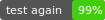

# badge-svg

A library to generate badge svg

[](https://david-dm.org/plantain-00/badge-svg)
[](https://david-dm.org/plantain-00/badge-svg#info=devDependencies)
[](https://travis-ci.org/plantain-00/badge-svg)
[](https://ci.appveyor.com/project/plantain-00/badge-svg/branch/master)
[](https://badge.fury.io/js/badge-svg)
[](https://www.npmjs.com/package/badge-svg)
[](https://unpkg.com/badge-svg)
[](https://github.com/plantain-00/badge-svg)

## install

`yarn add badge-svg`

## usage

```ts
import generateBadgeSvg from "badge-svg";
// <script src="./node_modules/badge-svg/badge-svg.min.js"></script>

generateBadgeSvg('test', '1.2.3')
generateBadgeSvg('test again', '99%')
```



